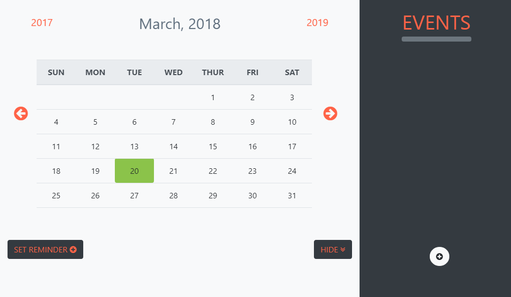

# Calendar Electron

## Ứng dụng lập lịch công việc

* Có khả năng khởi động cùng hệ thống.
* Bạn có thể xem lịch, tạo lập các sự kiện.
* Ứng dụng sẽ nhắc nhở bạn ít nhất là mỗi phút một lần.
* Ứng dụng được viết trên module [Electron](https://electronjs.org/)
* Tác giả VincentViet

# Hướng dẫn sử dụng:

### Ứng dụng sẽ khởi động cùng hệ thống và chạy ẩn

* Để mở giao diện ứng dụng, bạn double-click vào icon trên hình.
* Ta sẽ được giao diện như sau:

* Để thoát ựng dụng bạn nhấp chuột phải vào Hidden icon của ứng dụng, sau đó chọn Quit.
* Hãy tự khám phá tiếp nhé !!!
